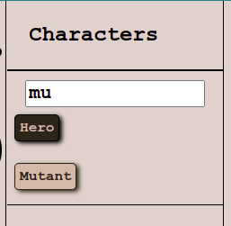
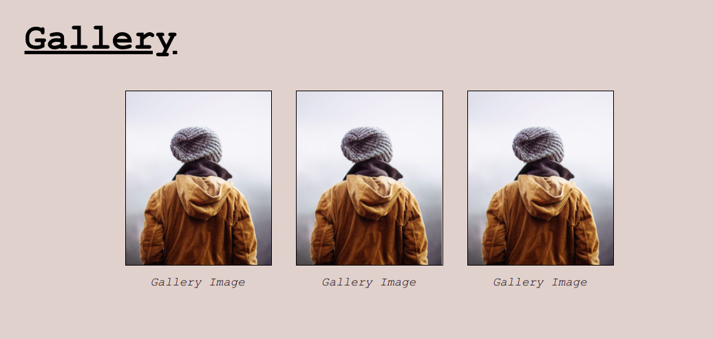
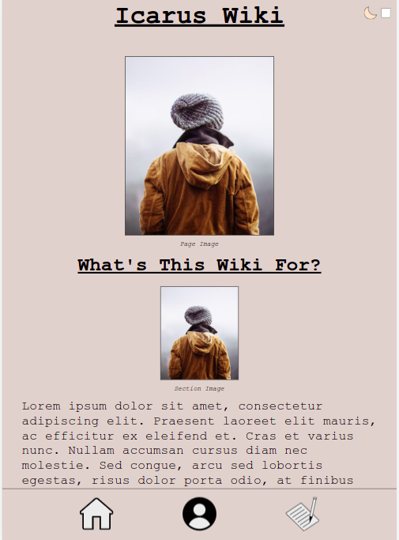

# Icarus Wiki

[](https://circleci.com/gh/JayOneTheSk8/icarus-wiki)

This is the Wiki for the story [Icarus](https://jayonethesk8.github.io/icarus/) built using TypeScript and bundled with Webpack.

[Click here](https://jayonethesk8.github.io/icarus-wiki/) if you would like to see the full wiki.

# Technical Info

The purpose of this project is to stand up a fully functioning wiki without the need of a DBMS. Typing was deemed necessary to be allow data to predictably be turned into HTML DOM Elements.

The HTML is fairly straightforward: the main `"page-content"` simply adds the DOM elements necessary by analyzing the `Page`'s content.

## CLI Page generation

A convenient file generator can be used. Run `npm run g -- -h` for more info.

## Page's `name` and `pageImage`

A `Page`'s content is fairly straightforward. Adding a `name` will create a header, and if a `pageImage` is present, it will adjust it under the header. A `Page` also must have an `id` and a `type` (either `'Characters'`, `'Notes'`, or `'Home Page'`).

```typescript
const HomePage: Page = {
    id: 'home_page',
    name: 'My Wiki',
    type: 'Home Page',
    pageImage: {
        url: 'https://www.w3schools.com/tags/img_girl.jpg',
        caption: 'Page Image'
    },
    sections: [...]
} 
```


### `Tags`

A `Page` can also have tags associated with it to find similar `Page`s. `tags` are a `Set` of strings and are displayed at the bottom of a `Page`.

```typescript
const CharacterPage: Page = {
    ...
    sections: [...],
    tags: new Set([
        'Hero',
        'Mutant',
        'Comic Relief'
    ])
} 
```


A convenient search for pages with the same `tags` is given to each individual section selector (i.e. `Notes` tags are separate from `Characters` tags).



### `PageSection`

Every page must have a list of sections. The basic `PageSection` is useful for paragraphs of information. A `sectionImage` can also be added for further detail.

```typescript
const whatsThis: PageSection = {
    title: "What's This Wiki For?",
    sectionImage: {
        url: 'https://www.w3schools.com/tags/img_girl.jpg',
        caption: 'Section Image'
    },
    body: 'Lorem ipsum dolor ...'
}
```


### `SubSection`

Sometimes paragraph text needs to be broken up into individual sections.This is where `SubSection`s become useful. A `PageSection`'s body can be text or a list of `SubSection`s. `SubSection`s can have images that are displayed adjacent to the `subSectionText`.

```typescript
const abilities: PageSection = {
    title: 'Abilites',
    body: [
        {
            subSectionTitle: 'Cool Move',
            subSectionImage: {
                url: 'https://www.w3schools.com/tags/img_girl.jpg',
                caption: 'Subsection Image'
            },
            subSectionText: 'Lorem ipsum dolor ...'
        },
        {
            subSectionTitle: 'Hot Moves',
            subSectionText: 'Lorem ipsum dolor ...'
        }
    ]
}
```


### `AttributesSection`

Attributes are typicaly more concise than other information. With that, a section with the `title` of any of the constants in the `ATTRIBUTES_TITLES_LIST` will be interpreted as an `AttributesSection` which will display individual `Attributes` in a grouped fashion.

```typescript
const attributes: AttributesSection = {
    title: ATTRIBUTES,
    attributes: [
        {
            attributeName: 'Age',
            attributeText: '16'
        },
        {
            attributeName: 'Occupation',
            attributeText: 'Social Worker'
        },
        {
            attributeName: 'Place of Birth',
            attributeText: 'New York, NY'
        },
        {
            attributeName: 'Other Thing',
            attributeText: 'Notes for other thing'
        }
    ]
}
```


### `GallerySection`

For a simple list of pictures, a `GallerySection` would be appropriate. A section with the `title` of any of the constants in the `GALLERY_TITLES_LIST` will be interpreted as a `GallerySection`.

```typescript
const gallery: GallerySection = {
    title: GALLERY,
    gallery: [
        {
            url: 'https://www.w3schools.com/tags/img_girl.jpg',
            caption: 'Gallery Image'
        },
        {
            url: 'https://www.w3schools.com/tags/img_girl.jpg',
            caption: 'Gallery Image'
        },
        {
            url: 'https://www.w3schools.com/tags/img_girl.jpg',
            caption: 'Gallery Image'
        }
    ]
}
```



### `AssociationsSection`

Some pages may be associated with others. `Association`s help display these relationships. A section with the `title` of any of the constants in the `ASSOCIATIONS_TITLES_LIST` will be interpreted as a `AssociationsSection`. Clicking on the name of the associated page directs the user to said page. Import the specific `Page`'s `id` and add it to the `associationPageIds`.

```typescript
import {
    JOE_SCHMOE_PAGE_ID,
    JOANNE_SCHMOE_PAGE_ID,
    ...
} from '../../page-ids'

const associations: AssociationsSection = {
    title: ASSOCIATIONS,
    associationPageIds: [
        {
            associationName: 'Allies',
            associations: [
                JOE_SCHMOE_PAGE_ID,
                JOANNE_SCHMOE_PAGE_ID,
                COOL_PERSON_PAGE_ID,
                HAPPY_PERSON_PAGE_ID,
            ]
        },
        {
            associationName: 'Enemies',
            associations: [
                BADGUY_JONES_PAGE_ID,
                MEAN_GIRLS_PAGE_ID,
                NORRIS_VILLAINE_PAGE_ID,
            ]
        },
        {
            associationName: 'Siblings',
            associations: [
                SAMANTHA_BYNES_PAGE_ID,
                CARL_BYNES_PAGE_ID,
            ]
        },
        {
            associationName: 'Best-Friend',
            associations: [
                COOLADIE_MAEBY_PAGE_ID,
            ]
        },
    ]
}
```


### Renaming Sections

It is possible that `title`s like `"Gallery"` and `"Associations"` may not cover the scope of what is in the section. If this is the case, new titles can be added to the `constants.ts` section arrays or by just changing the constants themselves and keeping the namespace.

```typescript
/* src-ts/constants.ts */

export const GALLERY: string = 'Gallery'
export const ATTRIBUTES: string = 'Attributes'
export const ASSOCIATIONS: string = 'Associations'

// Add new titles
export const FAMILY: string = 'Family'
export const FRIENDS: string = 'Friends'

export const GALLERY_TITLES_LIST: Array<string> = [GALLERY]
export const ATTRIBUTES_TITLES_LIST: Array<string> = [ATTRIBUTES]
// Sections with the title 'Family'/'Friends' will also be interpreted as a AssociationsSection
export const ASSOCIATIONS_TITLES_LIST: Array<string> = [ASSOCIATIONS, FAMILY, FRIENDS]
```

### Page `id`s

To prevent circular imports, instead of `AssociationsSection` being lists of `Page`s (which would be more straightforward), they are a list of `Page` `id`s. `id`s will be linked to `Page`s in an object in memory.

```typescript
/* src-ts/index.ts */
const PAGE_MAP: { [key: string]: Page } = {}

// Add homepage to page map
PAGE_MAP[homePage.id] = homePage

// Add character page to page map
PAGE_MAP[character.id] = character

// Add note page to page map
PAGE_MAP[note.id] = note
```

This is still a very clumsy way of managing `id`s in lieu of a DBMS. A `Page`'s `id` must be unique for the functionality to work. The solution was to maintain `page-id`s in a single file. This is far from perfect, but it at least allows a visual check of when `id`s could possibly overlap.

```typescript
/* src-ts/page-ids.ts */
const HOME_PAGE_ID: string = 'home_page'

const CHARACTER_ONE_PAGE_ID: string = 'character_one'
const CHARACTER_TWO_PAGE_ID: string = 'character_two'
```

## `Responsive`

This wiki is responive.

### Widescreen View


### Mobile View


## `Dark Mode`

Clicking on the moon or checkbox in the corner activates dark mode.


Dark mode can also be activated by default when setting the query params `dark` or `d` to equal `true` or `t`

(ex. `https://jayonethesk8.github.io/icarus-wiki/?d=t`)

Dark mode (as well as the primary colours) can be changed in the scss `_base-colours` file.

```scss
/* scss/_base-colours.scss */

$primary-background-colour: #dfd1cc;
$primary-font-colour: #000000;

$primary-icon-internal-colour: #ececec;

$dark-mode-background-colour: #2d2419;
$dark-mode-font-colour: #d3b9a9;
```

## `Picture Zoom`

When a picture is clicked, it zooms into fullscreen. Clicking on it or the modal reverts it back to normal.

### Portrait
#### Mobile


#### Widescreen


### Landscape
#### Mobile


#### Widescreen

