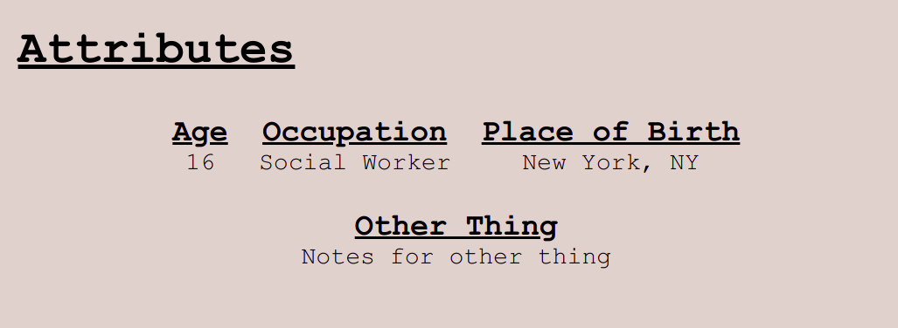
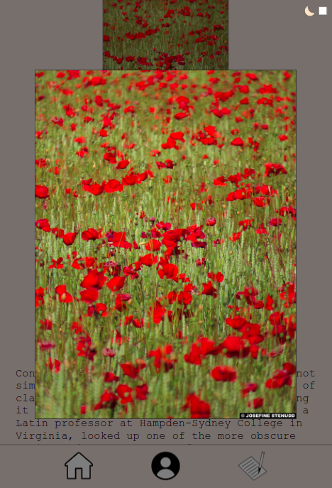
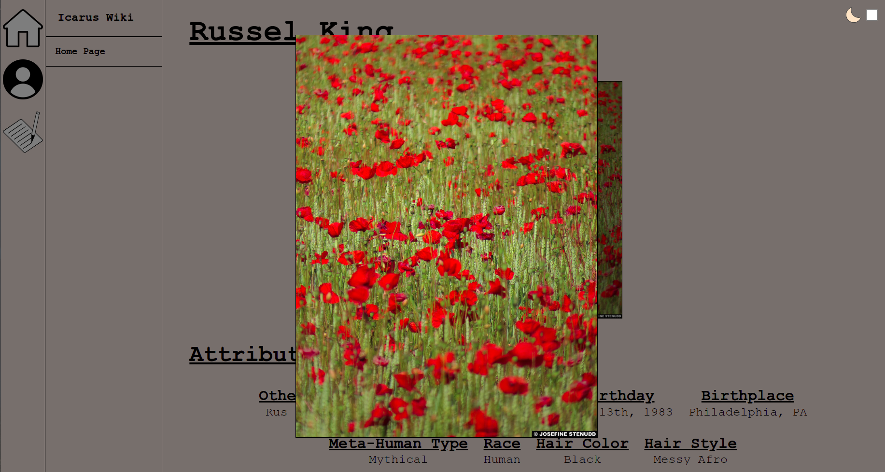
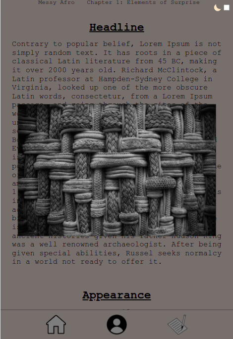

# Icarus Wiki

This is the Wiki for the story [Icarus](https://jayonethesk8.github.io/icarus/) built using TypeScript and bundled with Webpack.

[Click here](https://jayonethesk8.github.io/icarus-wiki/) if you would like to see the full wiki.

# Technical Info

The purpose of this project is to stand up a fully functioning wiki without the need of a DBMS. Typing was deemed necessary to be allow data to predictably be turned into HTML DOM Elements.

The HTML is fairly straightforward: the main `"page-content"` simply adds the DOM elements necessary by analyzing the `Page`'s content.

## Page's `name` and `pageImage`

A `Page`'s content is fairly straightforward. Adding a `name` will create a header, and if a `pageImage` is present, it will adjust it under the header.

```typescript
const HomePage: Page = {
    name: 'My Wiki',
    pageImage: {
        url: 'https://www.w3schools.com/tags/img_girl.jpg',
        caption: 'Page Image'
    },
    sections: [...]
} 
```


### `PageSection`

Every page must have a list of sections. The basic `PageSection` is useful for paragraphs of information. A `sectionImage` can also be added for further detail.

```typescript
const whatsThis: PageSection = {
    title: "What's This Wiki For?",
    sectionImage: {
        url: 'https://www.w3schools.com/tags/img_girl.jpg',
        caption: 'Section Image'
    },
    body: 'Lorem ipsum dolor ...'
}
```


### `SubSection`

Sometimes paragraph text needs to be broken up into individual sections.This is where `SubSection`s become useful. A `PageSection`'s body can be text or a list of `SubSection`s. `SubSection`s can have images that are displayed adjacent to the `subSectionText`.

```typescript
const abilities: PageSection = {
    title: 'Abilites',
    body: [
        {
            subSectionTitle: 'Cool Move',
            subSectionImage: {
                url: 'https://www.w3schools.com/tags/img_girl.jpg',
                caption: 'Subsection Image'
            },
            subSectionText: 'Lorem ipsum dolor ...'
        },
        {
            subSectionTitle: 'Hot Moves',
            subSectionText: 'Lorem ipsum dolor ...'
        }
    ]
}
```


### `AttributesSection`

Attributes are typicaly more concise than other information with that, a section with the `title` of `"Attributes"` will be interpreted as an `AttributesSection` which will display individual `Attributes` in a grouped fashion.

```typescript
const attributes: AttributesSection = {
    title: 'Attributes',
    attributes: [
        {
            attributeName: 'Age',
            attributeText: '16'
        },
        {
            attributeName: 'Occupation',
            attributeText: 'Social Worker'
        },
        {
            attributeName: 'Place of Birth',
            attributeText: 'New York, NY'
        },
        {
            attributeName: 'Other Thing',
            attributeText: 'Notes for other thing'
        }
    ]
}
```



### `GallerySection`

For a simple list of pictures, a `GallerySection` would be appropriate.

```typescript
const gallery: GallerySection = {
    title: 'Gallery',
    gallery: [
        {
            url: 'https://www.w3schools.com/tags/img_girl.jpg',
            caption: 'Gallery Image'
        },
        {
            url: 'https://www.w3schools.com/tags/img_girl.jpg',
            caption: 'Gallery Image'
        },
        {
            url: 'https://www.w3schools.com/tags/img_girl.jpg',
            caption: 'Gallery Image'
        }
    ]
}
```


## `Responsive`

This wiki is responive.

### Widescreen View


### Mobile View


## `Dark Mode`

Clicking on the moon or checkbox in the corner activates dark mode.


Dark mode as well as the primary colours can be changed in the scss `_base` file.

```scss
/* scss/_base.scss */

$primary-background-colour: #dfd1cc;
$primary-font-colour: #000000;

$primary-icon-internal-colour: #ececec;

$dark-mode-background-colour: #2d2419;
$dark-mode-font-colour: #d3b9a9;
```

## `Picture Zoom`

When a picture is clicked, it zooms into fullscreen. Clicking on it or the modal reverts it back to normal.

### Portrait
#### Mobile


#### Widescreen


### Landscape
#### Mobile


#### Widescreen


